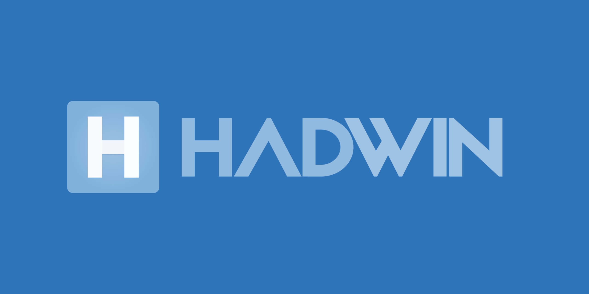
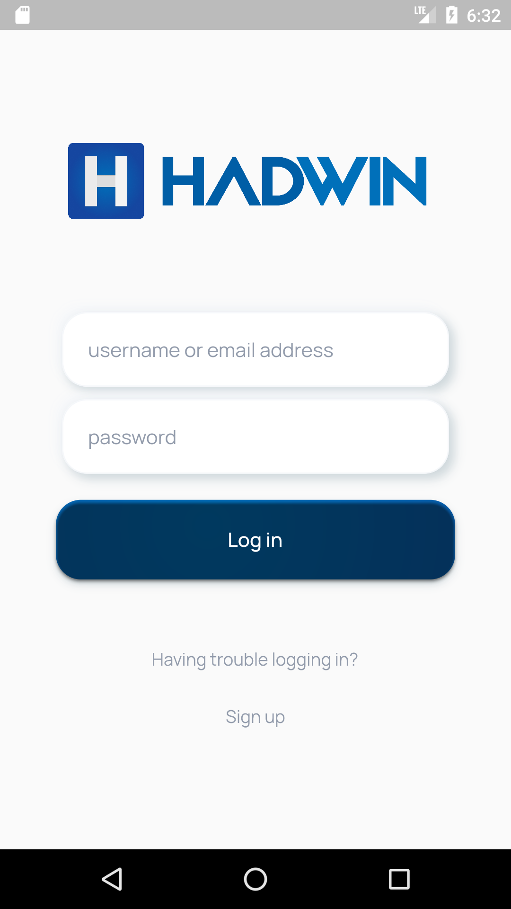
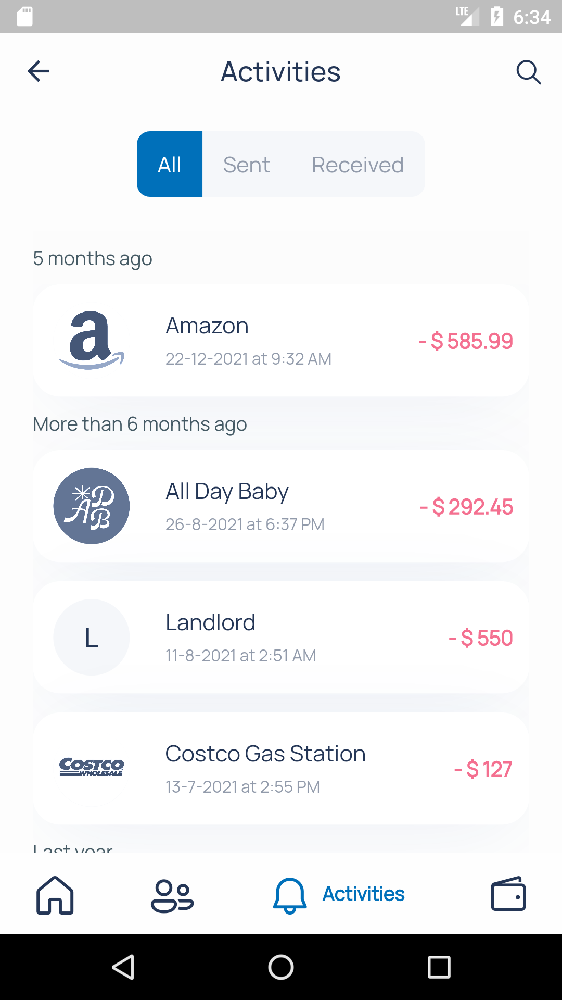
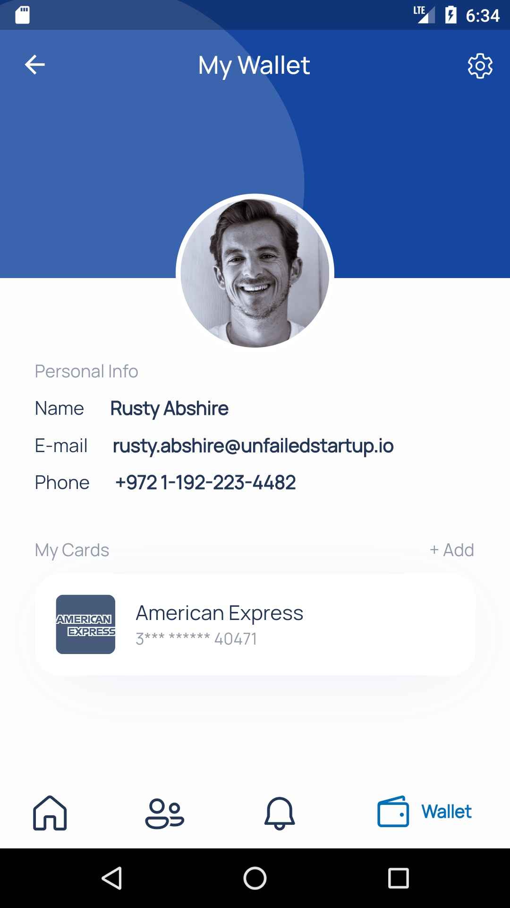

# HADWIN

<!--  -->

 

> **HADWIN** is a prototype of a fund transfer app created from UI designs discovered on Dribbble, Pinterest and Behance. **HADWIN** has been built using the [Flutter](https://flutter.dev/) framework. 

Since this is a prototype users cannot send or receive real money, and to save costs JSON data is being used instead of data from a dedicated database, transaction and card data will be saved on the users device itself and not shared with the server. 

 

[FruitCastle](https://fruitcastle.herokuapp.com/) ([source code 💡](https://github.com/brownboycodes/FruitCastle)) is a server created using [Python](https://www.python.org/) and [Flask](https://flask.palletsprojects.com/), which hosts the data being used to create simulation for authorizing access to the features to the app and making transactions.

If users want to test the QR code scanning feature of HADWIN, they are requested to go to [https://fruitcastle.herokuapp.com/hadwin/v2/qr-code-interpretter/random](https://fruitcastle.herokuapp.com/hadwin/v2/qr-code-interpretter/random) to obtain a random QR code image.

Users are requested to rest assured as no personal data is being saved on the server and if they are still concerned about their privacy users are allowed to test the app with the [mock data](./docs/HADWIN_WIKI.md) only.

click on the button below to checkout a working demo for android devices :  
 

 

 

---

 

### Screenshots

<table>
  <tr>
    <td style="text-align: center; vertical-align: middle;">Login Screen</td>
     <td style="text-align: center; vertical-align: middle;">Home Screen</td>
     <td style="text-align: center; vertical-align: middle;">Contacts Screen</td>
  </tr>
  <tr>
    <td></td>
    <td></td>
    <td></td>
  </tr>
 </table>
 <table>
  <tr>
    <td style="text-align: center; vertical-align: middle;">Activities Screen</td>
     <td style="text-align: center; vertical-align: middle;">Wallet Screen</td>
     <td style="text-align: center; vertical-align: middle;">Fund Transfer Screen</td>
  </tr>
  <tr>
    <td></td>
    <td></td>
    <td></td>
  </tr>
 </table>
 

 

---

### CREDITS 🌟

  ⭐ [PayPal App Redesign Concept](https://dribbble.com/shots/14114443-PayPal-App-Redesign-Conept) by [Vadim Demenko](https://dribbble.com/vdemenko) , follow Vadim on         

  ⭐[ Credit card - Checkout flow (AMEX)](https://dribbble.com/shots/2187649-Credit-card-Checkout-flow-AMEX) by [Ramakrishna Venkatesan](https://dribbble.com/RamakrishnaUX), follow Ramakrishna on            

  ⭐ [Auto Location Switching & Transaction Receipt](https://dribbble.com/shots/3669170-Auto-Location-Switching-Transaction-Receipt) by [Nimasha Perera](https://www.nimashaperera.com/), follow Nimasha on         

 

---

### ⚠ IMPORTANT ⚠

🚨 **HADWIN IS FREE APP THUS REPORT AND INFORM ABOUT ANY PAID VERSION BEING DISTRIBUTED ANYWHERE** 🚨. **HADWIN** has been created purely out of my own interest in building a sophisticated fund transfer platform for adding value to my portfolio. Again it is being remided that users cannot transfer/receive real money through this app (as of now), users are warned and forbidden from using real credit/debit card numbers or bank account numbers. Users may and if possible should only test this application with [mock data](./docs/HADWIN_WIKI.md) provided from my personal API hosting server (**FruitCastle** ([source code 💡]((https://github.com/brownboycodes/FruitCastle))). Account numbers and User details are fictitious, they have been generated randomly out of imagination, any resemblance of mock data with real people or account numbers is matter of sheer coincidence. The creator of this project not be/ cannot be held responsible for loss of any kind.

 

---

*Anyone attempting to infringe/plagarize my code to replicate this project or reproducing this project with exactly same code and claiming it as their own is being requested to play fair, try building this project on your own, it will help in better assessment of your app development skills and also properly attribute/give credit to the people and resources from which inspiration has been drawn from.*

---

 

            
