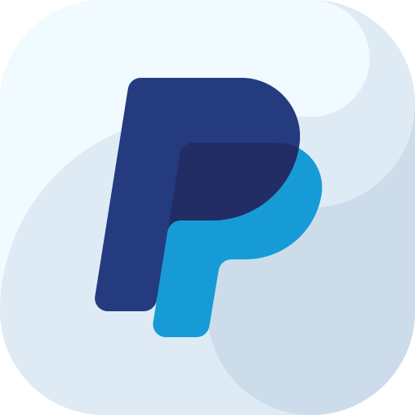

# *PayPal* concept 

 

***PayPal*** provides an easy and quick ⚡ way to send and request 📨 money 💵 online 🛰️. You can transfer money 💸 (abroad 🌎) to family 👨‍👩‍👧‍👦, friends, online shops 🛒, and auction sites like eBay.

 

💡 To learn more about ***PayPal*** go to:

  🔗 [what is PayPal and how does it work?](https://www.paypal.com/be/smarthelp/article/what-is-paypal-and-how-does-it-work-faq1655 "what is PayPal and how does it work?")
  🔗 [PayPal basics](https://www.paypal.com/ca/smarthelp/topic/PAYPAL_BASICS2 "basics of PayPal")

 

---

## Case Study 📑

  📦 **Frameworks/Libraries**: Flutter

  🏗 **Languages**: Dart, Swift, Kotlin, Objective-C

  ⚒ **Platforms**: Android 🤖, iOS 🍎

 

### Available Screens

- [ ] Login Screen
- [ ] User Registration Screen
- [ ] Dashboard Screen
- [ ] Wallet Screen
- [ ] Fund Transfer Screen
- [ ] User Profile Screen
- [ ] Contacts Screen
- [ ] User Settings  Screen
- [ ] Error Screen

 

#### 📱 Test Device Info

| COMPONENT              | DETAILS                 |
| ---------------------- | ----------------------- |
| device                 | Samsung Galaxy J7 Prime |
| CPU build              | android-arm64           |
| Android Version        | 6.0.1                   |
| API                    | 23                      |
| Screen diagonal length | 5.5 inches              |

 

---

### CREDITS 🙏❤

  ❤ [***PayPal***](http://www.paypal.com/) , [Sign up for free](https://www.paypal.com/in/webapps/mpp/account-selection?pros=1 "Happy shopping with PayPal") , to install the real *PayPal* app 🛒🛍,  you can  :    or   

  ❤ inspiration for the UI has been drawn from: [PayPal App Redesign Concept](https://dribbble.com/shots/14114443-PayPal-App-Redesign-Conept) by [Vadim Demenko](https://dribbble.com/vdemenko) , follow Vadim on         

  ❤ the [cover image](https://wearemucho.com/project/paypal-illustration/) for the [GitHub repository of this project](https://github.com/brownboycodes/Paypal-Concept-Flutter) has been taken from [Mucho](https://wearemucho.com/) , follow  **Mucho** on           

  ❤ the [logo](https://www.flaticon.com/premium-icon/paypal_2504931?term=paypal&page=1&position=1&page=1&position=1&related_id=2504931&origin=style)   for this [app](https://github.com/brownboycodes/Paypal-Concept-Flutter) has been taken from [Flaticon](https://www.flaticon.com/authors/ruslan-babkin) and it has been made by [Ruslan Babkin](http://ruslanbabkin.com/) ,  follow  Ruslan on      

  ❤ the image shown on **help for logging in**  screen     is titled [**Dr Monkey**](https://dribbble.com/shots/4203971-DR-MONKEY/attachments/10259300?mode=media) made by [Carlo Beranek](https://carloberanek.com/) , follow Carlo on       

 

---

### ⚠ DISCLAIMER ⚠

This project is not affiliated/sponsored with ***PayPal*** or any of its parent or subsidiary organizations. It is 🚨 **NOT FOR COMMERCIAL USE** 🚨. It has been and is being created purely out of my own interest in building a sophisticated payment system application to test my skills and add value to my portfolio. And hence it will not function like real products of ***PayPal***, *users cannot transfer real money through this application (as of now)*, users are warned and forbidden from using real credit/debit card numbers or bank account numbers. Users may and should only test this application with mock data provided from my personal API hosting server (**Common API Server** [source code 💡](https://github.com/brownboycodes/common-api-server) ). Account numbers and User details are fictitious, they have been generated randomly out of imagination, any resemblance of mock data with real people or account numbers is matter of sheer coincidence. The creator of this project or the genuine owners of ***PayPal*** will not be/ cannot be held responsible for loss of any kind.

 

---

*Anyone replicating this project or reproducing this project as their own is being requested to play fair and be kind ☺, try building this project on your own, it will help in better self-awareness/assessment of your app development skills and also properly attribute/give credit to the people and resources from which inspiration has been drawn from.*
