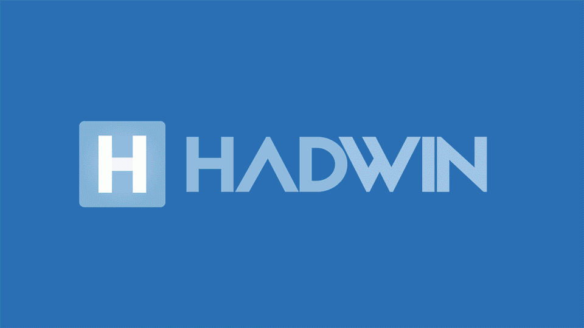
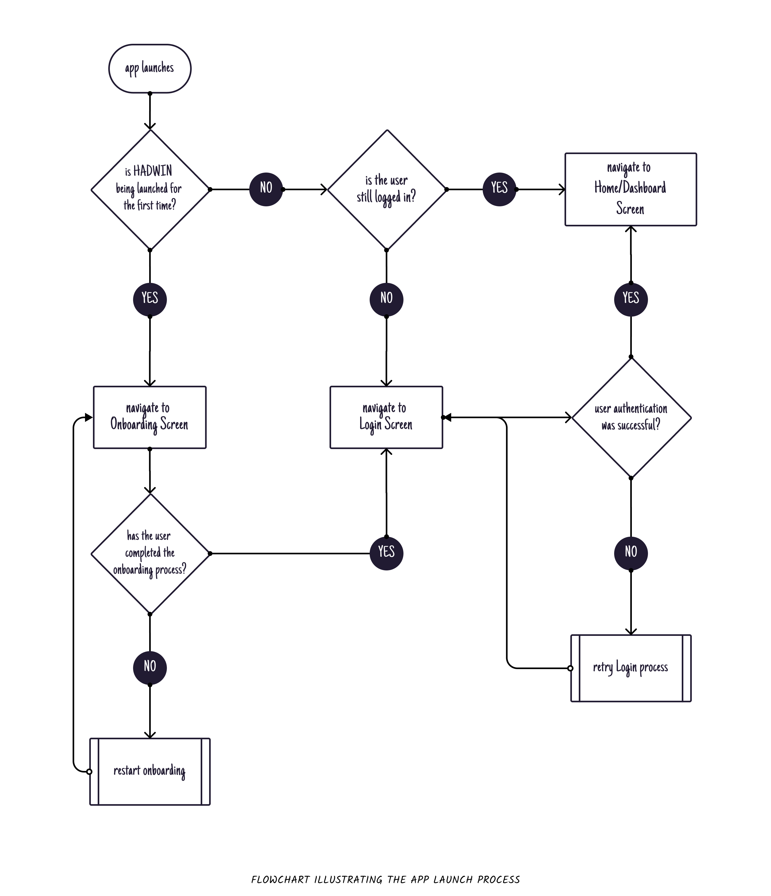
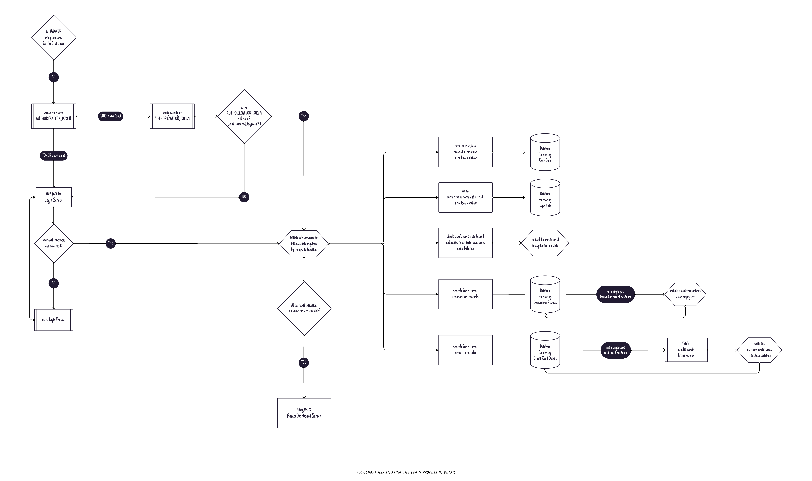
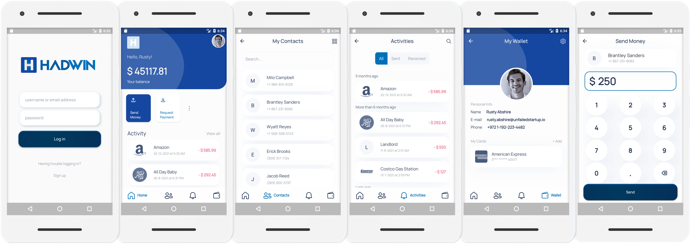

<!-- <h1 align="center"> HADWIN </h1> <br> -->

<!--  -->
<!-- > **HADWIN** is a prototype of a fund transfer app built with [Flutter](https://flutter.dev/).  -->

<!-- <br> -->

<div align="center">

<!-- <blockquote> -->
<p>prototype of a fund transfer app built with <a href="https://flutter.dev/">Flutter</a>. </p>
<!-- </blockquote> -->
<br>
  
</div>
<br>

[](https://flutter.dev/) [](https://dart.dev/) [](https://www.android.com/intl/en_in/) [](https://developer.apple.com/ios/) [](https://github.com/brownboycodes/HADWIN) [](https://www.buymeacoffee.com/brownboycodes)


   [](https://GitHub.com/brownboycodes/HADWIN/commit/)    [](https://github.com/brownboycodes/HADWIN/blob/main/LICENSE)

<br>

I wanted to make this app with flutter because I was interested in flutter developer roles.  I figured out this payment interface is a fundamental and common fragment of almost every app, since almost every app requires some sort of payment/transaction interface to be present, be it a video streaming service like Netflix or Disney+ during signing up for subscription or  a social networking platform like facebook or Instagram where an user needs to add their card details for promoting their content to reach more users. I wanted to build something that would cover demonstration of a wide range of skills required for an app developer, like - knowledge of architectural components & design patterns, state management/nested state management with provider, fetching data from servers to demonstrate proficiency with restful API to connect applications to back-end services, building a real time interface, using the Camera API, writing data to local files, custom navigation stack, complex animations, seamlessly incorporating third party packages, pixel-perfect implementation of UI designs (differs only because some improvisations I made), debugging, analysis skills & performance tuning. 

<br>

### FEATURES

  1. Fund Transfer - mock simulation only, a transaction request is made to the server, the server is programmed to respond with 66.666% probability of successfully executing the transaction so as to simulate real world experirence (in the future this probability can increased to 75% or more).
  
  <!-- 2. Scan to Pay - mock simulation only, QR Code Scanner is programmed to only recognize QR Codes of HADWIN accounts. -->

  2. Credit Card Validator and Storage - credit card details will be stored locally and not shared with the server, the validator is programmed to recognize cards belonging to American Express, VISA, MasterCard, Discover.
  3. Real-Time username availability checker - part of sign up process.

NOTE: Since this is a prototype users cannot send or receive real money, or create real accounts, users need to login/register with test data provided here ➡️ [https://github.com/brownboycodes/HADWIN/blob/master/docs/HADWIN_WIKI.md](https://github.com/brownboycodes/HADWIN/blob/master/docs/HADWIN_WIKI.md).
Transaction and credit card data will be saved on the users device itself and not shared with the server.

<br>

Some custom system utilities built by me :-

1. custom tab navigation stack
2. custom keypad and input field for fund transfer screen
3. custom card flow widget
4. custom transaction receipt generator
5. error alerts
6. search and sort systems for filtering past transactions, contacts and business organiztions
7. local client-side databases 


<br>

#### Sample user data for testing the app

|       NAME       |     USERNAME     |              EMAIL ID              |         PASSWORD        | BANK ACCOUNT NUMBER |
|:----------------|:----------------:|:----------------------------------:|:-----------------------:|:-------------------:|
| Mary Kertzmann   | mary.kertzmann   | mary.kertzmann@notillegal.org      | deer                    | 99293629            |
| Rusty Abshire    | rusty.abshire    | rusty.abshire@unfailedstartup.io   | parrot                  | 19285107 <br /> 21664761  |
| Dante Vandervort | dante.vandervort | dante.vandervort@junkstuff.net     | tiger                   | 67767567 <br /> 04295132  |
| Damion Jerde     | damion.jerde     | damion.jerde@costlyhotel.com       | chicken                 | 64045463 <br /> 42203582  |
| Bruce Wayne      | the.batman       | dark.knight@wayneenterprises.com   | aSymbol                 | 47911045 <br /> 19826115  |
| Tony Stark       | iamironman       | tonystank@starkindustries.com      | LoveU3000               | 39753176 <br /> 61428607  |
| Van Wilder       | freeguy          | deadpool@mcu.finally               | FirstDatesAreInterviews | 40429859 <br /> 53421343  |
| Van Helsing      | logan            | wolverine@xmen.marvel              | ryansUglySweater        | 23926044 <br /> 20166891  |
| Steve Harrington | king_steve       | king_steve@hawkins.high            | ussButterscotch         | 72389857 <br /> 91515917  |
| Meilin Lee       | red.panda        | mei@turning.red                    | 4town                   | 50881774 <br /> 11045853  |
| Diana Prince     | wonderwoman      | queen@amazon.race                  | Hippolyta               | 30646421 <br /> 39108502  |
| Selina Kyle      | catwoman         | jewelthief@gotham.city             | notTrustworthy          | 27772507 <br /> 36995137  |
| Natasha Romanoff | blackwidow       | natalierushman@starkindustries.com | daughterOfIvan          | 36841177 <br /> 10783270  |
| Jane Hopper      | el               | eleven@hawkins.laboratory          | eggo                    | 76131209 <br /> 59840666  |


<br>

<br>

anything else &nbsp; [](https://forthebadge.com) [](https://forthebadge.com) 🙈 

---

### WORKFLOW

The flowchart below provides a brief overview of the activities that take place when the app is launched

<br>

<p align="center"></p>

<br>
Post successful user authentication an authorized session would last upto 2 hours.
The login process is quite sophisticated on its own and it might get too overwhelming trying to understand it from reading the code, the flowchart below provides an overview of activities that take place during the login process, perhaps it will clear up the doubts behind the logic

<br>

<p align="center"></p>

<br>

<!-- If users want to test the QR code scanning feature of HADWIN, they are requested to go to [https://fruitcastle.onrender.com/hadwin/v2/qr-code-interpretter/random](https://fruitcastle.onrender.com/hadwin/v2/qr-code-interpretter/random) to obtain a random QR code image. -->

Users are requested to rest assured as no personal data is being saved on the server and if they are still concerned about their privacy users are allowed to test the app with the [mock data](./docs/HADWIN_WIKI.md) only.

<br>

<p align="center"></p>

[FruitCastle](https://fruitcastle.onrender.com/) ([source code 💡](https://github.com/brownboycodes/FruitCastle)) is a server created using [Python](https://www.python.org/) and [Flask](https://flask.palletsprojects.com/), which hosts the data being used to create simulation for authorizing access to the features to the app and making transactions.


checkout the working demo for android devices :  
<div align="center">


</div>

<br>

> HADWIN is yet to be released for iOS devices, anyone releasing an iOS app with the name or user interface same-as/similar-to HADWIN will be met with legal action.

<br>

---

<br>

### SAMPLE UI 📺

<br>

<p align="center">
<!-- 
 -->

</p>

<br>

<br>

---

<br>

### QUICK START ⚡

<br>

1. Ensure you have flutter installed on your system (if not click [here](https://docs.flutter.dev/get-started/install)).

2. Fork the repository
3. clone the repository to your local machine

    ```bash
    git clone https://github.com/YOUR_GITHUB_USERNAME/HADWIN.git
    ```

4. open the cloned repository

    ```bash
    cd HADWIN
    ```

5. run the following command to install all required dependencies

   ```bash
   flutter pub get
   ```

6. create and switch to a new branch

    ```bash
    git checkout -b dev_your_github_username
    ```

7. now open your local copy of the repo in a coding terminal of your choice and explore 😊🎉

<br>

---

<br>

### TASKS TO DO 📃

<br>

The tasks have been laid out in the format `task_type (SCOPE): the_task` and these tasks have been sorted in terms of their difficulty. Some tasks may accompany some conditions which have to be met before attempting, read and understand them carefully since a small unrectified mistake can wreck this project completely. Check the [contributing guidelines](./CONTRIBUTING.md) first.

<br>

#### Tasks ⤵

1. feature (UIUX): in the Login process, an alert box with an error message received from the server pops up every time a user enters the wrong credentials, create a counter that would track the number of times the user enters an username or email ID that does not belong to any account on the server, if the counter hits 3 times in a row then show an [option to take the user to the sign up screen](./media/ui_designs/alert-box-to-navigate-to-sign-up-screen-design.png) in the alert box that would appear. Maintain the existing UI and experience while doing so. 🚸✨
2. fix (UIUX): debug the Sign Up process, hopefully it can contain some flaws or maybe it can be simplified further while maintaining the existing UI and experience (hint: check the UI/UX of the sign up screen and its components for errors if any). 🚸🐛🩹
3. refactor : use [StreamBuilder](https://api.flutter.dev/flutter/widgets/StreamBuilder-class.html) in ChooseUsernameScreen
4. build (DEPENDENCIES): upgrade to the latest version of the flutter SDK without failing the build and crashing the app 👷‍♂️🏗⬆💥
5. build (DEPENDENCIES): if the flutter SDK version of the project is the latest available upgrade the dependencies of the project to the latest available version without failing the build and crashing the app 👷‍♂️⬆💥
6. build (DEPENDENCIES): if the flutter SDK version of the project is the latest available and the package [qr_code_scanner](https://pub.dev/packages/qr_code_scanner) has been discontinued, replace [qr_code_scanner](https://pub.dev/packages/qr_code_scanner) with [mobile_scanner](https://pub.dev/packages/mobile_scanner) and implement it without crashing the app. ➖📦➕
7. feature (LOCALIZATION): make HADWIN available in other languages (japanese, hindi, bengali, mandarin, spanish, french, german etc.) 🌐
8. test : write some meaningful tests maybe? 🧪🤔 
    
    
    
    just don't break anything... please

<br>

---
<br>

### DEPENDENCIES 📦

<br>

HADWIN uses the following dependencies:

  1. [provider](https://pub.dev/packages/provider) (📌6.0.2): A wrapper around InheritedWidget to make them easier to use and more reusable. ⚡
  1. [fluentui_system_icons](https://pub.dev/packages/fluentui_system_icons) (📌1.1.153): Fluent UI System Icons are a collection of familiar, friendly and modern icons from Microsoft. 🎨
  1. [http](https://pub.dev/packages/http) (📌0.13.4): A composable, multi-platform, Future-based API for HTTP requests. ⚡
  1. [fade_shimmer](https://pub.dev/packages/fade_shimmer) (📌2.0.1): A fade shimmer library to implement loading like lastest facebook loading effect. 🎨
  <!-- 1. [qr_code_scanner](https://pub.dev/packages/qr_code_scanner) (📌0.6.1): QR code scanner that can be embedded inside flutter. It uses zxing in Android and MTBBarcode scanner in iOS. ✨ -->
  1. [scrollable_positioned_list](https://pub.dev/packages/scrollable_positioned_list) (📌0.2.3): A list with helper methods to programmatically scroll to an item. ⚡
  1. [google_fonts](https://pub.dev/packages/google_fonts) (📌2.3.1): A Flutter package to use fonts from fonts.google.com. 🎨
  1. [lottie](https://pub.dev/packages/lottie) (📌1.2.2): Render After Effects animations natively on Flutter. This package is a pure Dart implementation of a Lottie player. 🎨
  1. [socket_io_client](https://pub.dev/packages/socket_io_client) (📌1.0.2): Dartlang port of socket.io-client for web, flutter, dartvm to use. ⚡✨
  1. [grouped_list](https://pub.dev/packages/grouped_list) (📌4.2.0): A Flutter ListView where the list items can be grouped into sections. ⚡
  1. [concentric_transition](https://pub.dev/packages/concentric_transition) (📌1.0.1): Concentric Transition effect. Useful for onboarding, page transitions etc. 🎨
  1. [dotted_line](https://pub.dev/packages/dotted_line) (📌3.1.0): This package allows you to draw dotted lines with Flutter. You can draw a beautiful dotted line. 🎨
  <!-- 1. [qr_flutter](https://pub.dev/packages/qr_flutter) (📌4.0.0): QR.Flutter is a Flutter library for simple and fast QR code rendering via a Widget or custom painter. ✨🎨 -->
  1. [url_launcher](https://pub.dev/packages/url_launcher) (📌6.0.20): Flutter plugin for launching a URL. Supports web, phone, SMS, and email schemes. ✨
  1. [google_nav_bar](https://pub.dev/packages/google_nav_bar) (📌5.0.6): A modern google style nav bar which could be use as a bottom navigation bar or tabbar, the design strictly follows the cuberto UI/UX on dribbble. 🎨⚡✨
  1. [path_provider](https://pub.dev/packages/path_provider) (📌2.0.9): Flutter plugin for getting commonly used locations on host platform file systems, such as the temp and app data directories. ⚡
  1. [markdown_widget](https://pub.dev/packages/markdown_widget) (📌1.2.8): A new markdown package. It supports TOC function, HTML video and img tag，and it works well on both the web and mobile. 🎨✨
  2. [flutter_launcher_icons](https://pub.dev/packages/flutter_launcher_icons) (📌0.9.2): A package which simplifies the task of updating your Flutter app's launcher icon. 🎨
  3. [flutter_native_splash](https://pub.dev/packages/flutter_native_splash) (📌2.0.1+1): Customize Flutter's default white native splash screen with background color and splash image. Supports dark mode, full screen, and more. 🎨

<br>

<!-- ##### LEGEND -->

<!--
| emoji  |  the scope where the dependency affects in the app  |
|:---:|:---:|
| 🎨 | UI  | 
| ⚡ | performance  | 
| ✨ | feature  | 
-->
<div align="center">
<h5 id="legend">emojis indicate the scope where the dependency affects in the app (check the table below)</h5>
<table>
<thead>
<tr>
<th style="text-align:center">emoji</th>
<th style="text-align:center">scope</th>
</tr>
</thead>
<tbody>
<tr>
<td style="text-align:center">🎨</td>
<td style="text-align:center">UI</td>
</tr>
<tr>
<td style="text-align:center">⚡</td>
<td style="text-align:center">performance</td>
</tr>
<tr>
<td style="text-align:center">✨</td>
<td style="text-align:center">feature</td>
</tr>
</tbody>
</table>
</div>

<br>

---


<br>

### CREDITS 🌟

  ⭐ [PayPal App Redesign Concept](https://dribbble.com/shots/14114443-PayPal-App-Redesign-Conept) by [Vadim Demenko](https://dribbble.com/vdemenko) , follow Vadim on &nbsp; [](https://dribbble.com/vdemenko)  [](https://www.behance.net/vdemenko)  [](https://www.instagram.com/vademenko/)  [](https://twitter.com/vademenko)  [](https://www.linkedin.com/in/vdemenko/)

  ⭐[Credit card - Checkout flow (AMEX)](https://dribbble.com/shots/2187649-Credit-card-Checkout-flow-AMEX) by [Ramakrishna Venkatesan](https://dribbble.com/RamakrishnaUX), follow Ramakrishna on &nbsp; [](https://dribbble.com/RamakrishnaUX)  [](https://www.behance.net/RamakrishnaV)  [](https://twitter.com/RamakrishnaUX)  [](https://www.linkedin.com/in/ramakrishnaux)  [](https://www.instagram.com/RamakrishnaUX/)  [](https://www.facebook.com/Ramakrishna.design)

  ⭐ [Auto Location Switching & Transaction Receipt](https://dribbble.com/shots/3669170-Auto-Location-Switching-Transaction-Receipt) by [Nimasha Perera](https://www.nimashaperera.com/), follow Nimasha on &nbsp; [](https://www.behance.net/nimashasperera)  [](https://dribbble.com/nimasha_sperera/)  [](https://twitter.com/nimasha_perera)  [](https://www.linkedin.com/in/nimashaperera/)  [](https://medium.com/@nimasha_perera)

  ⭐ [Work From Home Setup (Night)](https://dribbble.com/shots/17284897-Work-From-Home-Setup-Night) by [Mohamed Chahin](https://www.behance.net/MChahin), follow Mohamed on &nbsp; [](https://www.behance.net/MChahin)  [](https://dribbble.com/MohChahin/)  [](https://twitter.com/beastochahin)  [](https://www.linkedin.com/in/mohchahin/)  [](https://www.facebook.com/BeastoChahin)

  ⭐ [Online shopping at the best prices.](https://dribbble.com/shots/15636548-Online-shopping-at-the-best-prices) by [Yuliia Osadcha](https://linktr.ee/YuliiaOsadcha), follow Yulia on &nbsp; [](https://www.behance.net/yuliiaosadcha)  [](https://dribbble.com/YuliiaOsadcha/)  [](https://twitter.com/YuliiaOsadcha) [](https://www.instagram.com/yuliiaosadcha/)

<br>

---

<br>

### SUPPORT HADWIN  ❤

<br>

<!-- Place this tag where you want the button to render. -->
Add a star 

Fork the repository  

share on twitter &nbsp; [](https://twitter.com/intent/tweet?text=check%20out%20the%20repository%20of%20HADWIN%2C%20a%20prototype%20of%20a%20fund%20transfer%20platform%20built%20with%20flutter%20%0Ahttps%3A%2F%2Fgithub.com%2Fbrownboycodes%2FHADWIN)

share on facebook &nbsp; [](https://www.facebook.com/sharer.php?u=https%3A%2F%2Fgithub.com%2Fbrownboycodes%2FHADWIN)

share on LinkedIn &nbsp; [](https://www.linkedin.com/shareArticle?url=https%3A%2F%2Fgithub.com%2Fbrownboycodes%2FHADWIN&title=HADWIN&summary=prototype%20of%20a%20fund%20transfer%20app%20built%20with%20flutter&source=HADWIN)


<br>

---

<br>

### CONTRIBUTORS


<br>

---

### ⚠ IMPORTANT ⚠


**HADWIN** has been created purely out of my own interest in building a sophisticated fund transfer platform for adding value to my portfolio. Again it is being reminded that users cannot transfer/receive real money through this app (as of now), users are warned and forbidden from using real credit/debit card numbers or bank account numbers. Users may and if possible should only test this application with [mock data](./docs/HADWIN_WIKI.md) provided from my personal API hosting server (**FruitCastle** ([source code 💡]((https://github.com/brownboycodes/FruitCastle))). Account numbers and User details are fictitious, they have been generated randomly out of imagination, any resemblance of mock data with real people or account numbers is matter of sheer coincidence. The creator of this project not be/ cannot be held responsible for loss of any kind.


<br>

---

*Anyone attempting to infringe/plagarize my code to replicate this project or reproducing this project with exactly same code and claiming it as their own is being requested to play fair, try building this project on your own, it will help in better assessment of your app development skills and also properly attribute/give credit to the people and resources from which inspiration has been drawn from.*

---

<br>


[](https://github.com/brownboycodes)  [](https://www.twitter.com/brownboycodes)  [](https://www.linkedin.com/in/brownboycodes)  [](https://www.instagram.com/brownboycodes/)  [](https://www.facebook.com/brownboycodes)  [](https://www.reddit.com/user/brownboycodes/) 
